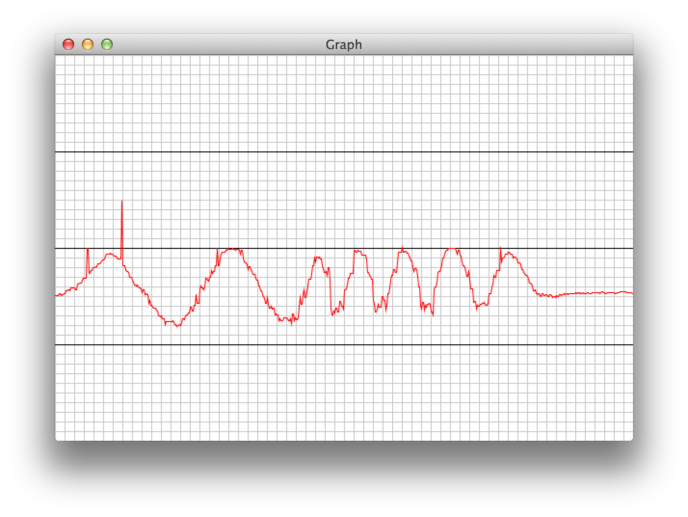
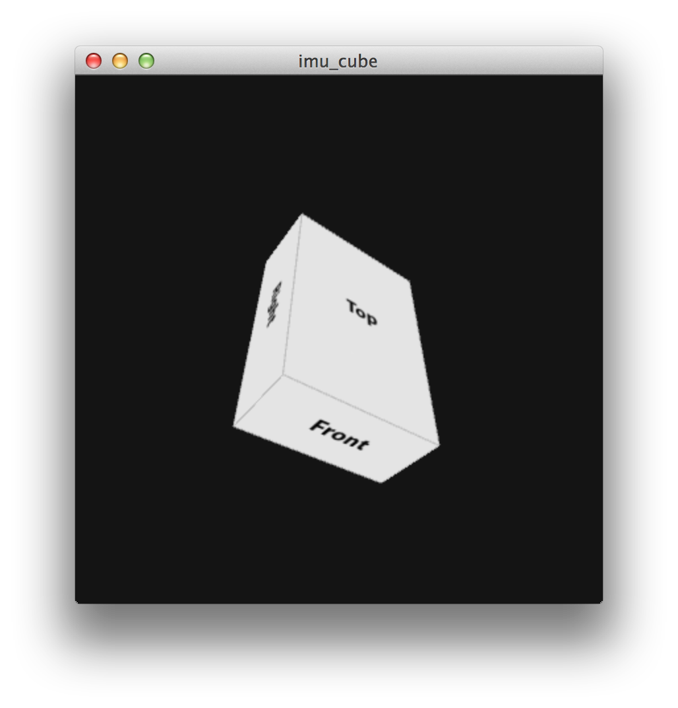

# 9dof_stick

This is my first attempt at using the [9DOF Stick](https://www.sparkfun.com/products/10724) from Sparkfun with the [mbed LPC1768](http://mbed.org/handbook/mbed-NXP-LPC1768).


## Pin Layout

| 9DOF Pin      | LPC1768 Pin    |
| ------------- | -------------- |
| SCL           | 27             |
| SDA           | 28             |
| GND           | GND			 |
| VIN           | VOUT           |


## Serial Output

At this stage this project reads the output form the accelerometer and outputs the values to the serial output. 

Serial Connection:

```
usbmodem1422 / 9600
```

Serial Format:

```
{Kalman X}\t{Kalman Y}\t\n

Example:
90.2345    87.5678    
```

## Build and Run

I don't like the online development environment offered by the mbed. They've done a good job but it just cannot compete with a local development environment where you can use whatever tools you like. I've managed to piece together a Makefile that will allow you to compile and deploy the project to the LPC1768 from command line.

### Build

Build the app from the command line

```
make
```

Deploy the app to the LPC1768

```
make deploy
```

**Note:** You'll need to reset the board for it to run the new build.


## Graph

This is a [Processing](http://processing.org) application that allows you to visualize the data from the 9DOF.
Simple open and run Graph/Graph.pde in the Processing app.



## IMU Cube

This is another [Processing](http://processing.org) application that tried to visualise the data from the 9DOF as a 3D cube.
Simple open and run imu_cube/imu_cube.pde in the Processing app.




